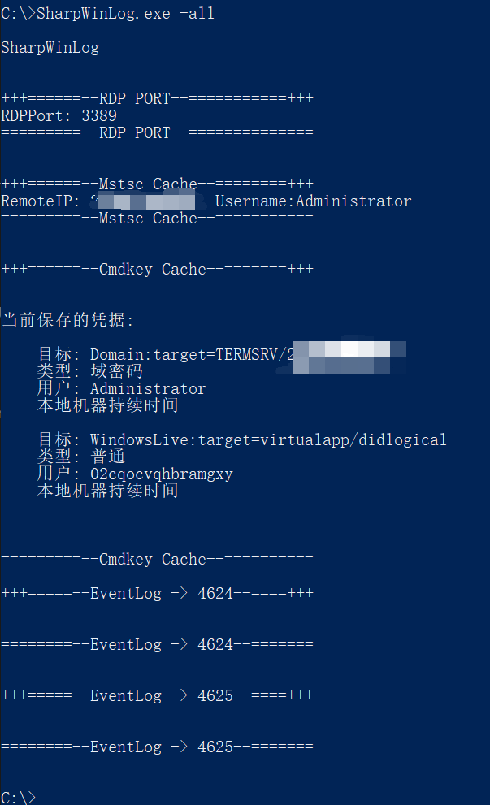

# SharpWinLog

### Introduction

This project is modified from the [SharpEventLog](https://github.com/uknowsec/SharpEventLog) project of [@uknowsec](https://github.com/uknowsec). The original project aimed to extract all computer information related to login failures or successful login attempts in the Chinese language system. The project was modified to extract information from the English language system and added Cmdkey reading and Mstsc Cache reading and RDP Port acquisition to facilitate penetration. (Repeated wheel making)

### How to Use it

```
C:\>SharpWinLog.exe

SharpWinLog
Author: Unknown
Github: https://github.com/UnknownU0/SharpWinLog

Usage: SharpWinLog.exe -4624
       SharpWinLog.exe -4625
       SharpWinLog.exe -rdp
       SharpWinLog.exe -all
```



### Cobalt Strike

```
execute-assembly /path/to/SharpWinLog.exe
```


### TODO

Unrestricted system language

### Acknowledgement

[@uknowsec](https://github.com/uknowsec)